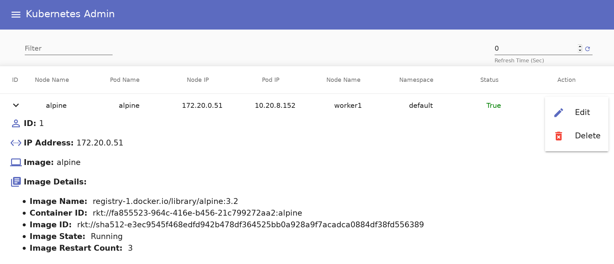

# kubernetes-admin-gui
Kubernetes Admin GUI

This repository contains a Web GUI/UI to administrator a Kubernetes cluster.

<h4>Versions</h4>
The current version is <b>Version 0.2</b>.
The version history and change log is available <a href="VERSION.md">here</a>.
 
<h3>Getting Started</h3>

<h4>Installation</h4>
<h4>Dependencies / Prerequisites</h4>
<b>The following Applications / Modules are required:</b>
<pre>
Mongodb 3+
NodeJS 9+
Angular 5+
</pre>

<h4>Application Layout Details</h4>
The directory layout is explained below.
<ol>
<li><b>Top directory: </b>app/</li>
<li><b>Backend (NodeJS): </b>app/backend/</li>
<li><b>Frontend (Angular): </b>app/frontend</li>
</ol>

<h4>Usage examples</h4>
To use the Admin GUI, follow the steps below.
<i>Note: </i>Additional details will be updated <a href="http://www.devtech101.com/">On my blog (coming soon).</a>

Key Modules (still being updated)
<ol>
<li>Angular Flex-layout</li>
<li>Angular Material 2</li>
<li>Angular Router</li>
<li>Bootstrap 4 / Bootstrap-ng</li>
<li>Font-awesome</li>
</ol>

<h5>Prerequisite Configuration</h5>
<ol>
<li><b>Make sure to start/enable Mongodb: </b> On Ubuntu: apt-get install -y mongodb-org systemctl start mongod systemctl enable mongod Note: the config file is in /etc/mongodb.conf</li>
<li><b>Clone this repo: </b> git clone https://github.com/elik1001/kubernetes-admin-gui.git </li>
<li><b>Install / configure the backend: </b> cd app/backend npm install <b>Start the backend</b> node app.js OR nodemon app.js</li>
<li><b>Install / configure the fronend: </b> cd fronend npm install </li>
<li><b>Make available the kubernetes remote api (or run on the api master): </b> coreos2 ~ # ssh -R 8080:localhost:8080 kub-admin-host </li>
<li><b>Update master api ip: </b> modify "apiMasterIp" in fronend/src/app/data.service.ts with your api IP i.e. backend real ip (localhost will not work) apiMasterIp = '10.10.10.10';</li>
<li><b>Finally start the frontend: </b>ng serve --host 0.0.0.0 --port 4200</li>
</ol>

Access the Web GUI/UI on port 4200, for example:
http://kub-admin:4200

<h5>Configure Master IP</h5>
In the web GUI/UI click on configure, add you master hostname and IP address

Add master API IP addrees 
 

<b>Administrate Nodes and check status</b>

Node status
 

<b>Administrate Pods and check status</b>

Pod status
 

<b>Admin Menu GUI/Admin</b>

Admin menu
 

<h4>Future updates coming soon</h4>
<ol>
<li>Authentication / Authorization </li>
<li>The ability to Add Pods / Nodes</li>
<li>The ability to Modify Nodes / Pods</li>
<li>The ability to Delete Nodes / Pods</li>
<li>Show additional Node / pod details in a popup</li>
<li>Show Node / Pod statistics as spark lines or full charts</li>
</ol>

<h4>License</h4>
This project is licensed under the MIT License - see the LICENSE file for details.
